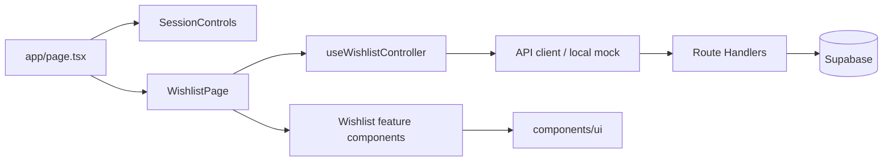

# Wishlist

欲しいものを画像・カテゴリ・欲しい度とともに管理する、Next.js + Supabase製のWishlistアプリです。

UIエンジニア / デザインエンジニア向けポートフォリオとして、機能数だけでなく、再利用可能なUI設計、アクセシビリティ、テスト容易性、継続的な品質保証を重視しています。

## Demo

| Target | URL |
| --- | --- |
| Application | [Vercelで開く](https://my-web-app-lemon-ten.vercel.app/) |
| Storybook | https://sora03pt.github.io/wishlist-app/ |
| Repository | [sora03pt/wishlist-app](https://github.com/sora03pt/wishlist-app) |

### Screenshots

ログイン画面、Wishlist一覧、Storybookの画面キャプチャは公開前の最終確認後に追加予定です。存在しない画像へのリンクは置いていません。

## Features

- メールアドレスとパスワードによるSupabase Auth
- ユーザー単位で分離されたWishlistの作成・取得・編集・削除
- ブラウザでWebPへ縮小・圧縮してから行う画像アップロード
- 5段階の欲しい度、カテゴリ、価格、URL、メモの管理
- 購入済み / 未購入ステータスと合計金額の表示
- モバイルファーストのレスポンシブUI
- 開発時のみ使う、Supabaseへ接続しないローカルモック

## Tech Stack

| Area | Technology |
| --- | --- |
| Application | Next.js 16 App Router, React 19, TypeScript |
| Styling | Tailwind CSS 4, semantic Design Token |
| UI | shadcn/uiを基にしたUI primitives, Radix UI, Lucide React |
| Backend | Next.js Route Handlers, Supabase Database / Auth / Storage |
| Component development | Storybook 10, Docs, Controls, Accessibility addon |
| Testing | Playwright, axe-core |
| Quality | ESLint, TypeScript, GitHub Actions, Lighthouse CI |
| Hosting | Vercel, GitHub Pages（Storybook） |
| Development support | Claude Code, Codex, Playwright MCP / browser automation |

## Architecture

Wishlistドメインをfeature単位でまとめ、汎用UIとページ固有ロジックの境界を明確にしています。

```text
app/                         # App Router、認証画面、Route Handlers
components/ui/               # featureに依存しないUI primitives
features/wishlist/
  api/                       # API clientとlocal mock
  components/                # Wishlist固有のpresentation
  hooks/                     # 画面状態と操作を束ねるcontroller
  lib/                       # 画像圧縮などのdomain utility
  model/                     # 型、定数、変換処理
lib/supabase/                # browser / server / proxy client
e2e/                         # ユーザー導線を検証するPlaywrightテスト
stories/                     # Foundationsと横断的なAccessibility資料
```



初期実装では`app/page.tsx`に約1,645行の取得・状態管理・画像処理・フォーム・表示が集中していました。挙動とデザインを維持したままAPI / model / hooks / presentationへ分離し、現在のページは組み立てとServer / Client境界の提示が中心です。

Server Component化そのものは目的にせず、認証セッション表示は独立したClient境界、対話的なWishlist本体はClient Componentとして維持しています。これによりhydration範囲を抑えつつ、状態管理を不自然に複雑化しない構成にしています。

## Design System

### Design Token

`app/globals.css`で、用途を表すsemantic tokenを管理しています。

- `background` / `surface` / `foreground` / `muted`
- `border` / `focus` / `selected`
- `primary` / `accent` / `destructive`
- `radius` / `shadow`

ブランドや状態の意味を持つ値はToken化し、余白や文字サイズなどTailwind標準スケールで一貫性を保てる値は無理にCSS Variablesへ移していません。

### Component classification

- **Design System / UI primitives**: Button、Input、Select、Dialog、Badge、Tooltip、FormField、FormMessage、Loading indicator
- **Feature Components**: WishlistCard、WishlistForm、StarRating、ImageDropzone、WishlistのLoading / Error / Empty State

Storybookに掲載されていることとDesign Systemであることは同義にしていません。WishlistCardやWishlistFormは商品管理の型や操作に依存するため、`components/ui`へ移さず`features/wishlist/components`に置いています。

StorybookではColors、Typography、Spacing、Border Radius、ShadowのFoundationsに加え、主要コンポーネントのVariants、Controls / Args、Docs、モバイル幅、エラーや無効状態を確認できます。

## Accessibility

WCAG 2.2 AAを判断基準にし、自動検査だけで「完全準拠」とは扱わず、意味・操作・通知の設計と手動確認を組み合わせています。

- StarRatingはnative radioを使い、radiogroupのラベル、checked状態、矢印キー操作、明確なFocus Visibleを提供
- labelとinputを関連付け、必須・`aria-invalid`・`aria-describedby`・FormMessageを一貫して伝達
- 保存や更新には`role="status"`、失敗には`role="alert"`を必要な場面だけで使用
- Radix Dialogのfocus trap、Escape、triggerへのfocus復帰、title / descriptionを活用
- 商品画像は商品を識別する情報として商品名をaltに使用し、装飾画像は空altとする方針
- h1、section heading、list / listitemなど、画面の意味が分かるsemantic HTML
- muted textを含む主要TokenをAAコントラストに調整

Storybook Accessibility addonはコンポーネント単体、axe E2EはLogin・Wishlist・入力中・Dialog表示中など統合状態を検査します。キーボードの導線、focusの視認性、読み上げの自然さは自動検査で完結しないため、手動確認項目として残しています。

## Testing

テスト数ではなく、ユーザーに重要で回帰リスクの高い導線を選んでいます。

- 未認証からmock Loginを経てWishlistへ到達
- 空の商品名に対するvalidation、関連するエラー、問題のinputへのfocus
- Wishlistの作成・表示・編集・購入状態変更・削除
- StarRatingとSelectのキーボード操作
- DialogをEscapeで閉じた後のtriggerへのfocus復帰
- 非同期中のdisabled状態と二重送信防止
- 画像選択、preview、保存、商品名altでの表示
- heading / list / formのsemantic structure
- Desktop ChromiumとPixel 7相当のMobile viewport
- Login、Wishlist、入力状態、Dialogに対するaxe検査

Locatorは`getByRole`、`getByLabel`、accessible nameを優先し、テスト都合の`data-testid`は追加していません。各テストは独立したBrowserContextを使い、mock認証とWishlistを`localStorage`へ初期化するため、本番Supabaseやsecretに依存せず再実行できます。固定sleepと`networkidle`への依存もありません。

```bash
npm run test:e2e
npm run test:e2e:ui
```

Storybook addonはisolated component、Playwright + axeは実際の画面構成とユーザーフローを担当します。実スクリーンリーダーによる読み上げ品質は自動化対象にしていません。

## CI / Quality Gate

Pull Requestと`main`へのpushで、次をGitHub Actionsから実行します。

1. `npm ci`
2. `npm run lint`
3. `npm run typecheck`
4. `npm run build`
5. `npm run build-storybook`
6. `npm run test:e2e`

どれかが失敗するとQuality Gateも失敗します。E2E失敗時はPlaywright report、trace、screenshot、videoを7日間Artifactとして保存し、ローカルで再現しにくい失敗を追跡できるようにしています。

Storybookは`main`へのpush時に別workflowでstatic buildし、GitHub公式Pages Actionsからデプロイします。Pages未公開のため、初回成功後にこのREADMEのDemoリンクを実URLへ更新します。

## Performance

Lighthouseを複数回計測し、単発スコアではなく中央値と実測上のボトルネックを基に改善しました。

| Metric | Before | After |
| --- | ---: | ---: |
| Login initial JavaScript | 219 KB | 148 KB（32.6%削減） |
| Login LCP median | 557 ms | 488 ms |
| Login SEO | 91 | 100 |
| Wishlist Accessibility | 96 | 100 |
| Wishlist CLS | 0 | 0 |

WishlistのPerformance `97 -> 100`、LCP `1,214 ms -> 562 ms`も観測しましたが、development環境由来の変動を含むため参考値です。

主な改善はSupabase SDKのdynamic import、SessionControlsのClient境界整理、`robots.ts`、muted tokenのcontrast、URLのaccessible name、商品画像の`sizes`最適化です。

Wishlist全体のServer Component化、React.memoの一括導入、signed URL画像の過剰なProxy、CLS対策だけを目的とした不自然な`min-height`は採用していません。実測上の効果に対し、複雑性や認証・Storageの安全性を増やす価値が小さいと判断したためです。

## Lighthouse CI

Login画面をproduction buildで3回測定し、中央値を評価します。

- Performance / Accessibility / Best Practices / SEO: 95以上
- CLS: 0.1以下
- LCP / TBT: 変動を観測するwarning
- HTML / JSON report: 7日間Artifactとして保存
- local mockを使用し、production secretは不要

Performanceを100固定にせず、CI環境の揺らぎで開発を止めない現実的な閾値にしています。

```bash
npm run lighthouse:audit
```

## AI Development Workflow

Claude CodeとCodexを、実装の代替ではなく調査・検証・レビューを加速する協働ツールとして利用しました。Playwright MCP / browser automationも、表示確認やfocus、Console、Lighthouse計測条件の確認に使っています。

1. 人が採用ポートフォリオとしての優先順位と完了条件を定義
2. AIがリポジトリ全体を調査し、変更範囲とリスクを整理
3. 人が設計判断を確認し、レビュー可能なPhaseへ分割
4. AIが既存設計を尊重して実装し、lint / typecheck / build / Storybook / E2Eで検証
5. 人がUI、アクセシビリティ、外部サービス設定、PRを最終確認

プロジェクト固有のskill / instructionには、mainへ直接pushしないこと、実装後にWeb previewを確認すること、PR本文を日本語で簡潔に記載することなどを定義しました。AIの提案はそのまま採用せず、実測値、コード差分、テスト結果を人が判断材料として確認しています。

## Engineering Decisions

| Decision | Reason |
| --- | --- |
| WishlistCardをDesign Systemへ移さない | Wishlistの型と操作に依存するFeature Componentだから |
| StarRatingにnative radioを使う | 支援技術とキーボード操作をブラウザ標準のsemanticsで保証しやすいから |
| E2Eでaccessible locatorを優先する | アクセシビリティとユーザー視点の回帰テストを同じ設計で支えるため |
| 本番SupabaseをE2E対象にしない | secret、データ汚染、外部要因による不安定さをQuality Gateへ持ち込まないため |
| Wishlist全体をServer Component化しない | 対話状態が多く、分割の複雑性に対する実測メリットが小さいため |
| React.memoを一括導入しない | 計測根拠のないmemo化は依存関係と保守コストを増やすため |
| Lighthouseを複数回実行する | 単発値の揺らぎを成果や失敗として誤認しないため |
| Performance 100をGateにしない | CI環境差を考慮し、ユーザー体験と継続運用を優先するため |

## Local Development

### Requirements

- Node.js 24（`package.json`では`>=24 <26`）
- npm

```bash
npm ci
npm run dev
```

[http://localhost:3000](http://localhost:3000)を開きます。開発サーバーではSupabaseへ接続せず、認証・Wishlist・圧縮後の画像をブラウザの`localStorage`へ保存します。

- `@`を含むメールアドレスと8文字以上のパスワードで疑似ログインできます。
- ログインと新規登録は疑似セッションを作成し、確認メールは送信しません。
- データは疑似ログインしたメールアドレスごとに分離されます。
- ブラウザのサイトデータを削除するとmockデータも削除されます。

### Environment variables

本番ビルドやVercelからSupabaseへ接続する場合は、`.env.example`を参考に`.env.local`またはVercel Environment Variablesへ次を設定します。実値はcommitしません。

```text
NEXT_PUBLIC_SUPABASE_URL=
NEXT_PUBLIC_SUPABASE_PUBLISHABLE_KEY=
```

`SUPABASE_SECRET_KEY` / Service Role Keyは通常動作に使用していません。設定する場合も`NEXT_PUBLIC_`を付けず、Client Componentへ渡さないでください。

### Commands

```bash
npm run lint
npm run typecheck
npm run build
npm run storybook
npm run build-storybook
npm run test:e2e
npm run lighthouse:audit
```

Storybookは[http://localhost:6006](http://localhost:6006)で開きます。`npm run build`は検証環境でも安定して確認できるようWebpackを明示しています。

## Database Setup

`supabase/migrations/`には、初期`todos`テーブルからWishlist項目、画像、Auth / RLS / Storage Policyまでを再現するmigrationを置いています。初期migrationは`create table if not exists`のため、既存テーブルやデータを削除しません。

### Fresh Supabase project

```bash
npx supabase link --project-ref <PROJECT_REF>
npx supabase db push --dry-run
npx supabase db push
```

### Existing linked project

後続migrationがすでに適用済みの環境では、今回追加した初期migrationがremote historyより古くなります。履歴とdry runを確認してから、未記録のmigrationを含めて適用してください。

```bash
npx supabase migration list
npx supabase db push --include-all --dry-run
npx supabase db push --include-all
```

本番DBへ`db reset`は実行しないでください。Dashboardから手動変更したschemaとmigration historyが一致しない場合は、差分を確認してからSupabase CLIのmigration repairを検討します。

Authを使う場合は、Supabase Dashboardの **Authentication > URL Configuration** にcallbackを登録します。

```text
http://localhost:3000/auth/callback
https://<Vercelの本番ドメイン>/auth/callback
```

Auth migrationは`todos.user_id`、本人の行だけを許可するCRUD用RLS、非公開`wishlist-images/{user_id}/...`のStorage Policyを設定します。

### Existing data migration

既存行は削除されません。`user_id`が`null`の行はRLSにより一覧へ表示されないため、Dashboardで対象AuthユーザーのUUIDを確認して割り当てます。

```sql
update public.todos
set user_id = '<MY_USER_ID>'
where user_id is null;
```

割り当て後に必須化する場合のみ、次を実行します。

```sql
alter table public.todos
alter column user_id set not null;
```

実際のUUIDを推測してmigrationへ埋め込んでいません。

## Known Limitations

- 本番Supabase / RLS / Storageを使うE2Eは未実施
- E2EブラウザはChromiumのみで、Firefox / WebKitは未対象
- 実スクリーンリーダーによる自動テストは未導入
- Visual Regression Testは未導入
- StorybookのGitHub Pages公開は初回workflow実行前
